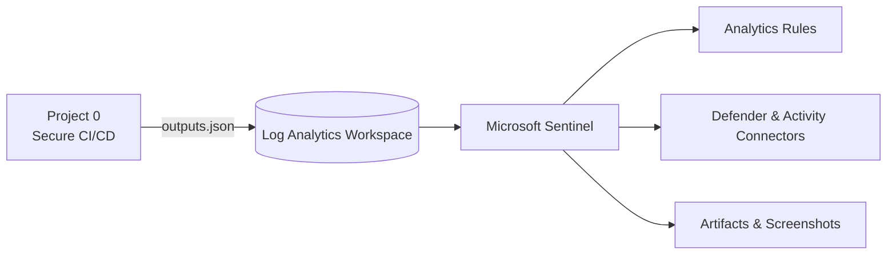

<!-- Profile README for github.com/fedlinllc -->

<h1 align="center">FEDLIN — Public Portfolio</h1>

<em>Security Engineering Labs.</em>

---

### Featured

**Project 0 — Secure CI/CD Baseline**  
Provision + verify Azure infra with OIDC-only pipelines and machine-readable outputs for downstream labs.  
  
[Run Project 0](https://github.com/fedlinllc/fedlin-azure-secure-cicd/actions/workflows/deploy-azure.yml) · [README](https://github.com/fedlinllc/fedlin-azure-secure-cicd#readme)

**Project 1 — Sentinel Vulnerability & Compliance Lab**  
Wire Microsoft Sentinel to LAW, enable data connectors, seed analytics, and ship evidence via GitHub Actions (OIDC only).  
  
[Run Project 1](https://github.com/fedlinllc/fedlin-azure-cis-vulnerability-lab/actions/workflows/azure-sentinel-vulncomp-lab.yml) · [README](https://github.com/fedlinllc/fedlin-azure-cis-vulnerability-lab#readme)  
📸 Evidence: [Screenshots](https://github.com/fedlinllc/fedlin-azure-cis-vulnerability-lab/tree/main/docs/evidence) · [Artifacts](https://github.com/fedlinllc/fedlin-azure-cis-vulnerability-lab/actions)

---

### Tech

---

### Flow

---

### Roadmap
- [x] Project 0: Secure CI/CD Baseline  
- [x] Project 1: Sentinel Vulnerability & Compliance Lab  
- [ ] Project 2: Hardening & Remediation (Defender assessments → Ansible → re-assessment)

---

### Stack
`Linux (Ubuntu, Debian)` · `Cloud platforms` · `CI/CD` · `OIDC / identity federation` · `Policy-as-code` · `IaC` · `Observability / logging` · `Detection engineering`

---
