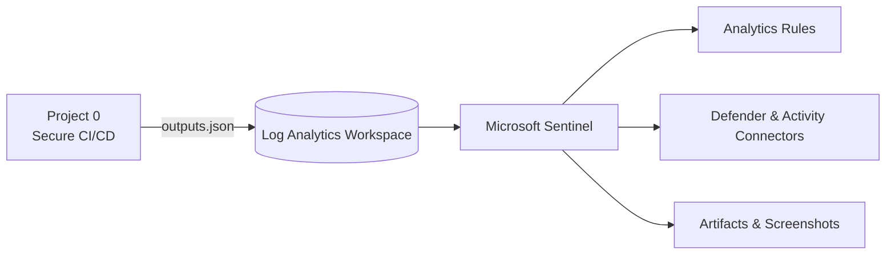

<!-- Profile README for github.com/fedlinllc -->

<h1 align="center">FEDLIN — Public Portfolio</h1>
<p align="center"><em>Security Engineering Labs.</em></p>

---

### Featured

**Project 0 — Secure CI/CD Baseline**  
<sub>Provision + verify Azure infra with OIDC-only pipelines and machine-readable outputs for downstream labs.</sub>  
[](https://github.com/fedlinllc/fedlin-azure-secure-cicd/actions/workflows/deploy-azure.yml)  

**Project 1 — Sentinel Vulnerability & Compliance Lab**  
<sub>Wire Microsoft Sentinel to LAW, enable data connectors, seed analytics, and ship evidence via GitHub Actions (OIDC only).</sub>  
[](https://github.com/fedlinllc/fedlin-azure-cis-vulnerability-lab/actions/workflows/azure-sentinel-vulncomp-lab.yml)  

---

### Tech


---

### Flow

---

### Roadmap
- [x] Project 0: Secure CI/CD Baseline  
- [x] Project 1: Sentinel Vulnerability & Compliance Lab  
- [ ] Project 2: Hardening & Remediation (Defender assessments → Ansible → re-assessment)

---

### Stack
`Linux (Ubuntu, Debian)` · `Cloud platforms` · `CI/CD` · `OIDC / identity federation` · `Policy-as-code` · `IaC` · `Observability / logging` · `Detection engineering`

---

## Featured — AWS

<a href="https://github.com/fedlinllc/fedlin-vercel-aws-baseline"><b>Vercel × AWS Baseline for Regulated Apps</b></a>  
<sub>Astro on Vercel in front, API Gateway/Lambda in back — SSO-operated, CORS-locked, and compliance-ready via optional evidence automation.</sub>

[](https://fedlin-vercel-aws-baseline.vercel.app)
[](https://github.com/fedlinllc/fedlin-vercel-aws-baseline/releases/tag/v0.1.0-showcase)
[](https://github.com/fedlinllc/fedlin-vercel-aws-baseline)
[](https://github.com/fedlinllc/fedlin-vercel-aws-baseline/actions/workflows/ci.yml)
[](https://github.com/fedlinllc/fedlin-vercel-aws-baseline/blob/main/LICENSE)

### AWS Flow (high-level)
```mermaid
flowchart LR
  FE[Vercel (Astro)] --> APIGW[API Gateway (HTTP v2)]
  APIGW --> LBD[Lambda /health]
  LBD --> S3[(S3 — Evidence artifacts)]
  subgraph Controls
    SSO[SSO — IAM Identity Center]
    CORS[CORS — Prod origin only]
  end
  SSO -.operations.-> APIGW
  CORS -.enforcement.-> APIGW
::contentReference[oaicite:0]{index=0}
