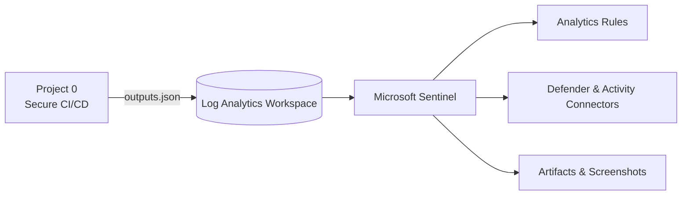

<!-- Profile README for github.com/fedlinllc -->

<h1 align="center">FEDLIN — Public Portfolio</h1>
<p align="center"><em>Security Solutions Architecture.</em></p>

### Tech


---

### Stack
`Identity & Access (OIDC/SSO: Entra ID, IAM Identity Center)` · `IAM / RBAC / ABAC` ·  
`AWS (API Gateway, Lambda, S3, CloudFront, WAF)` · `Azure (ARM, APIM, Storage)` ·  
`IaC (Terraform, Bicep)` · `Policy-as-code (AWS SCP/IAM, Azure Policy)` ·  
`CI/CD (GitHub Actions, OIDC federation)` ·  
`Observability (CloudWatch/CloudTrail, Log Analytics, Sentinel)` ·  
`Compliance automation (AWS Config, Security Hub, evidence workflows)` ·  
`Networking & App Security (TLS, CORS, rate limiting)` ·  
`Serverless & APIs (HTTP v2, event patterns)` ·  
`Linux (Ubuntu/Debian)` · `Vercel` · `Astro`

---


### Featured - Azure

**Project 0 — Secure CI/CD Baseline**  
<sub>Provision + verify Azure infra with OIDC-only pipelines and machine-readable outputs for downstream labs.</sub>  
[](https://github.com/fedlinllc/fedlin-azure-secure-cicd/actions/workflows/deploy-azure.yml)  

**Project 1 — Sentinel Vulnerability & Compliance Lab**  
<sub>Wire Microsoft Sentinel to LAW, enable data connectors, seed analytics, and ship evidence via GitHub Actions (OIDC only).</sub>  
[](https://github.com/fedlinllc/fedlin-azure-cis-vulnerability-lab/actions/workflows/azure-sentinel-vulncomp-lab.yml)  


---

### Flow

---

### Roadmap
- [x] Project 0: Secure CI/CD Baseline  
- [x] Project 1: Sentinel Vulnerability & Compliance Lab  
- [ ] Project 2: Hardening & Remediation (Defender assessments → Ansible → re-assessment)


---

## Featured — AWS

<a href="https://github.com/fedlinllc/fedlin-vercel-aws-baseline"><b>Vercel × AWS Baseline for Regulated Apps</b></a>  
<sub>Astro on Vercel in front, API Gateway/Lambda in back — SSO-operated, CORS-locked, and compliance-ready via an optional evidence add-on.</sub>

[](https://fedlin-vercel-aws-baseline.vercel.app)
[](https://github.com/fedlinllc/fedlin-vercel-aws-baseline/releases/tag/v0.1.0-showcase)
[](https://github.com/fedlinllc/fedlin-vercel-aws-baseline)
[](https://github.com/fedlinllc/fedlin-vercel-aws-baseline/actions/workflows/ci.yml)
[](https://github.com/fedlinllc/fedlin-vercel-aws-baseline/blob/main/LICENSE)

### AWS Flow (high-level)
```mermaid
flowchart LR
  FE["Vercel (Astro)"] --> APIGW["API Gateway (HTTP v2)"]
  APIGW --> LBD["Lambda /health"]
  LBD --> S3["S3 (evidence artifacts)"]

  subgraph Controls
    SSO["SSO (IAM Identity Center)"]
    CORS["CORS (prod origin only)"]
  end

  SSO -. operations .-> APIGW
  CORS -. enforcement .-> APIGW

