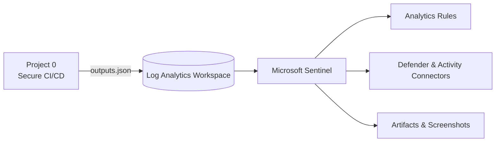
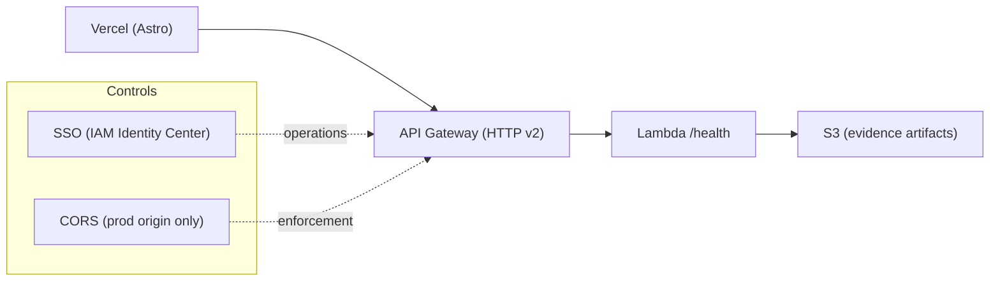
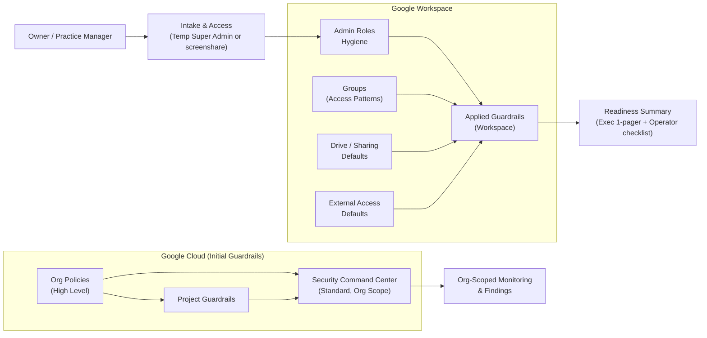

<!-- Profile README for github.com/fedlinllc -->

<h1 align="center">FEDLIN</h1>

<em>Security Solutions Architecture.</em>

### Skills
`Discovery & Requirements (stakeholder interviews, constraints, SLAs)` ·
`Solution Architecture (reference designs, integration patterns, data flows)` ·
`Identity & Access (OIDC/SSO, IAM/RBAC/ABAC, least privilege)` ·
`Security & Governance (SCC Standard, Guardrails, Policy-as-Code, secrets hygiene)` ·
`Landing Zones & Baselines (Workspace hardening, org policies, account structure)` ·
`API & App Patterns (HTTP v2, async events, zero-trust edges, rate limiting)` ·
`Delivery (IaC: Terraform/Bicep, GitHub Actions via OIDC, reviews & change mgmt)` ·
`Reliability & Ops (observability, runbooks, error budgets, incident basics)` ·
`Compliance Enablement (evidence automation, audit trails, DR/BCP touchpoints)`

### Tech

-334155)

-2088FF?logo=githubactions&logoColor=white)

---

### Stack
`Identity & Access (OIDC/SSO: Entra ID, IAM Identity Center)` · `IAM / RBAC / ABAC` ·  
`AWS (API Gateway, Lambda, S3, CloudFront, WAF)` · `Azure (ARM, APIM, Storage)` ·  
`IaC (Terraform, Bicep)` · `Policy-as-code (AWS SCP/IAM, Azure Policy)` ·  
`CI/CD (GitHub Actions, OIDC federation)` ·  
`Observability (CloudWatch/CloudTrail, Log Analytics, Sentinel)` ·  
`Compliance automation (AWS Config, Security Hub, evidence workflows)` ·  
`Networking & App Security (TLS, CORS, rate limiting)` ·  
`Serverless & APIs (HTTP v2, event patterns)` ·  
`Linux (Fedora/Ubuntu/Debian)` · `Vercel` · `Astro`

---

## Featured — Azure

**Project 0 — Secure CI/CD Baseline**  
Provision + verify Azure infra with OIDC-only pipelines and machine-readable outputs for downstream labs.  

**Project 1 — Sentinel Vulnerability & Compliance Lab**  
Wire Microsoft Sentinel to LAW, enable data connectors, seed analytics, and ship evidence via GitHub Actions (OIDC only).  

---

### Flow (Azure)

---

### Roadmap
- [x] Project 0: Secure CI/CD Baseline  
- [x] Project 1: Sentinel Vulnerability & Compliance Lab  
- [ ] Project 2: Hardening & Remediation (Defender assessments → Ansible → re-assessment)

---

## Featured — AWS

<a href="https://github.com/fedlinllc/fedlin-vercel-aws-baseline"><b>Vercel × AWS Baseline for Regulated Apps</b></a>  
Astro on Vercel in front, API Gateway/Lambda in back — SSO-operated, CORS-locked, and compliance-ready via an optional evidence add-on.

### Flow (AWS)

---

## Featured — GCP

<a href="https://github.com/fedlinllc/fedlin-gws-hipaa-baseline"><b>HIPAA Readiness for Google Workspace + GCP </b></a>  
Fixed-scope deployment to bring Google Workspace under HIPAA-aligned controls — <b>SCC (Standard) at org scope</b> with guardrails across <b>Admin roles, Groups, Drive/Sharing, external access defaults</b> — plus a documented readiness summary. (No public screenshots/how-tos; evidence stays in tenant.)

<!-- If/when you add a CI workflow in the showcase repo, you can also show it:

-->

### Flow (GCP + Workspace)

