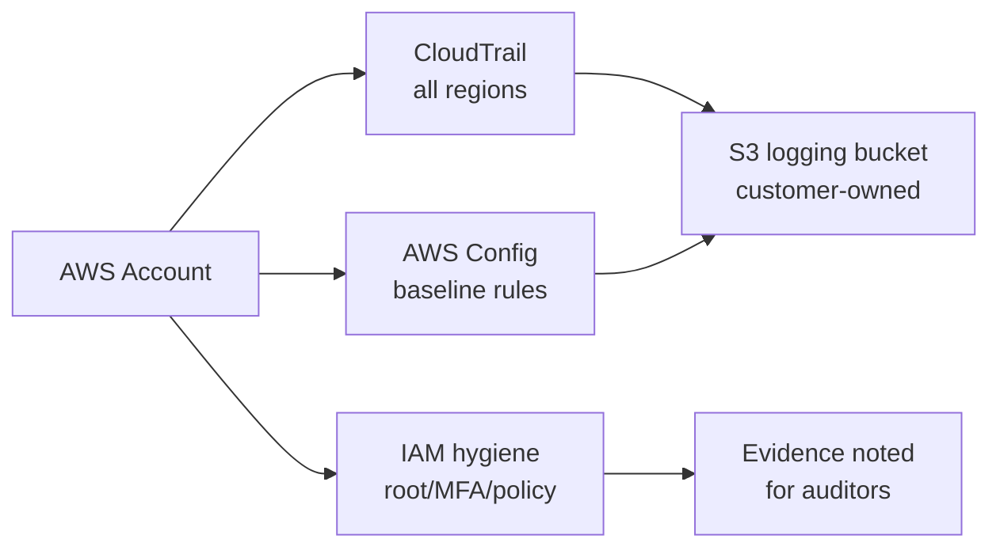
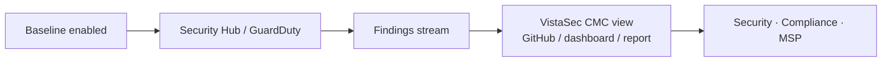
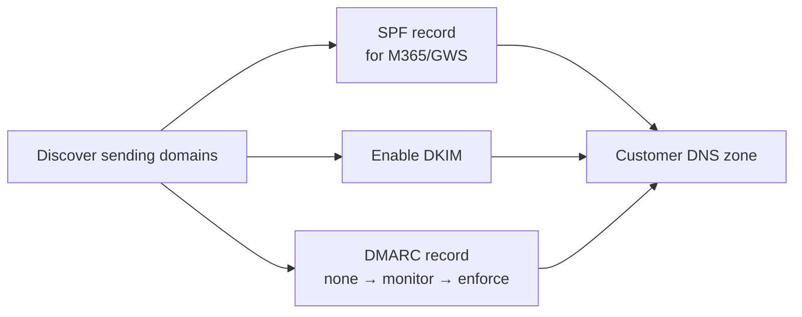

<h1 align="center">FEDLIN</h1>
<p align="center"><b>Security Solutions Architecture · Vulnerability Management · Compliance Automation</b></p>
<p align="center">Independent / C2C · Subcontract-ready · Customer-tenant-first</p>

<p align="center">
  
  
  
  
  
  
  
</p>

## About

FEDLIN is a security engineering and compliance automation consultancy. We build **customer-tenant-first** solutions — evidence, logs, and configuration stay in **your** AWS, Azure/Entra, Microsoft 365, Google Workspace, or GCP environment — and we deliver changes through **GitHub Actions with OIDC** so there are no long-lived secrets to rotate or vault.

We work well with security teams, MSPs, and primes that need to **show** cloud/SaaS security posture and **leave the evidence with the customer** — the way SOC 2, ISO 27001, and HIPAA-style reviews actually expect.

## What We Deliver

### AWS Security Baseline
Hardens an AWS account with CloudTrail (all regions), AWS Config, IAM hygiene, and customer-owned logging — written in the style SOC 2 / ISO 27001 reviewers expect.
↳ repo: https://github.com/fedlinllc/fedlin-aws-security-baseline



---

### AWS “VistaSec” CMC (Continuous Monitoring Center)
Adds a monitoring/reporting layer on top of the baseline so security, compliance, or an MSP can **show** AWS posture on demand. Pairs with Security Hub / GuardDuty.
↳ repo: https://github.com/fedlinllc/fedlin-aws-vistasec-cmc



---

### Microsoft 365 / Entra Security Baseline
Identity-first hardening: MFA / Conditional Access, admin-role separation, safer sharing defaults, and audit/eDiscovery readiness — structured for repeatable delivery.
↳ repo: https://github.com/fedlinllc/fedlin-m365-security-baseline

```mermaid
flowchart LR
    A[M365 / Entra tenant] --> B[MFA + CA]
    A --> C[Admin roles separated]
    A --> D[Safer sharing settings]
    A --> E[Audit & eDiscovery ready]
    F[GitHub Actions OIDC] --> A


### Google Workspace HIPAA Baseline
Workspace security for telehealth / therapy / PHI-adjacent orgs: admin hygiene, sharing controls, 2SV, and tenant-side evidence. Public brief only; deployment stays private.
↳ repo: https://github.com/fedlinllc/fedlin-gws-hipaa-baseline

```mermaid
flowchart LR
    A[GWS tenant] --> B[Admin / role hygiene]
    A --> C[Drive / sharing controls<br/>PHI-aware]
    A --> D[Security / 2SV enforced]
    A --> E[Audit / reports<br/>kept in tenant]
```

---

### Email Authentication (DMARC / SPF / DKIM)
Aligns M365 or GWS mail with customer-owned DNS, safe DMARC rollout (none → monitor → enforce), and optional CI-based DNS validation.
↳ repo: https://github.com/fedlinllc/fedlin-dmarc-spf-dkim



---

All services follow the same delivery pattern — **`SERVICE_SCOPE.md` → `EVIDENCE_MODEL.md` → `DELIVERY_MODEL.md` → GitHub Actions (OIDC-only)** — so they’re easy to subcontract, audit, or hand to an MSP.

How we engage (business / C2C)

C2C / 1099 friendly. Independent consultant model supported.

Subcontract-ready. Each repo has a defined scope so primes can see what’s delivered.

Customer-owned evidence. We do not insist on hosting your logs/exports — we show you where to put them.

Secure delivery. GitHub Actions with OIDC → no long-lived AWS/Microsoft credentials to rotate.

Contact

Website: https://www.fedlin.com
