<h1 align="center">FEDLIN</h1>

<b>Enterprise-Grade Security. Simply Delivered.</b>

Helping SaaS companies pass security reviews and close enterprise deals.

  
  
  

---

## 🔒 The Problem We Solve

Most SaaS apps fail basic security scans. Enterprise procurement teams check security headers, cloud configs, and compliance docs **before they sign.** That gap costs deals.

We fix it. **A+ security ratings in 1-2 weeks.** Scope-based pricing — you know the cost upfront.

```mermaid
flowchart LR
    A[🔍 Scan] --> B[📋 Scope]
    B --> C[🛡️ Secure]
    C --> D[✅ Enterprise Ready]
    
    style A fill:#1565C0,color:#fff
    style B fill:#1565C0,color:#fff
    style C fill:#1565C0,color:#fff
    style D fill:#22d3ee,color:#000
```

---

## 🛠️ Free Security Scanner

**See what enterprise buyers see — before they do.**

Most sites score **F**. Check yours instantly at [fedlin.com](https://fedlin.com)

→ [View the source](https://github.com/fedlinllc/security-headers-scanner)

---

## 📦 What We Deliver

### Web Application Security

  
  

Security headers, WAF rules, CSP configuration, bot protection. Turn an F into an A+ in 1-2 weeks.

→ [fedlin-web-app-security](https://github.com/fedlinllc/fedlin-web-app-security)

---

### Cloud Security

  
  
  
  

Multi-cloud hardening: AWS, Azure, GCP, Microsoft 365. IAM hygiene, storage security, network controls, compliance evidence.

→ [fedlin-cloud-security](https://github.com/fedlinllc/fedlin-cloud-security)

---

### Penetration Testing

  
  

OWASP-based web app and API testing. You get findings + an attestation letter for security questionnaires.

→ [fedlin-pen-testing](https://github.com/fedlinllc/fedlin-pen-testing)

---

### Email Security

  

Stop email spoofing. DMARC policy progression from none → monitor → enforce.

→ [fedlin-email-security](https://github.com/fedlinllc/fedlin-email-security)

---

### Google Workspace HIPAA

  
  

HIPAA-compliant Workspace configuration for clinics, telehealth platforms, and healthcare SaaS.

→ [fedlin-gws-hipaa](https://github.com/fedlinllc/fedlin-gws-hipaa)

---

### Enterprise Ready (Full Package)

  
  

Everything above + compliance documentation + security questionnaire support. Go from "not ready" to "enterprise ready."

→ [fedlin-enterprise-ready](https://github.com/fedlinllc/fedlin-enterprise-ready)

---

## 🎯 Who We Help

- **SaaS Companies** — Enterprise deals blocked by security requirements
- **Healthcare & Telehealth** — HIPAA compliance for Google Workspace
- **Development Firms** — White-label security for your clients
- **Regulated Industries** — CMMC, FedRAMP, NIST compliance

---

## ⚡ Why FEDLIN

| | |
|---|---|
| **Scope-Based Pricing** | You know the cost upfront. No hourly surprises. |
| **Fast Delivery** | A+ ratings in 1-2 weeks for most engagements. |
| **Principal-Led** | Work directly with senior expertise. |
| **Customer-Owned Evidence** | Logs, configs, and evidence stay in your environment. |

---

## 📊 Expertise

  

  
  
  

---

## 👤 About

**Jeremiah Coakley** — Principal Security Architect

10+ years securing enterprise environments — Fortune 100 healthcare, financial services, energy, retail. Now bringing that expertise to growth-stage companies that need enterprise-grade security without enterprise-grade complexity.

---

## 📬 Get Started

| | |
|---|---|
| **Free Scan** | [fedlin.com](https://fedlin.com) |
| **Book a Call** | [arrangr.com/fedlin](https://arrangr.com/fedlin) |
| **Email** | info@fedlin.com |

---

Enterprise-Grade Security. Simply Delivered.

